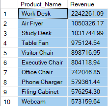
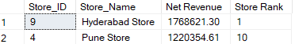
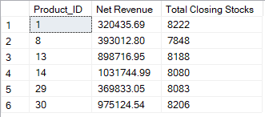
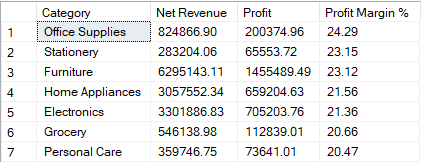
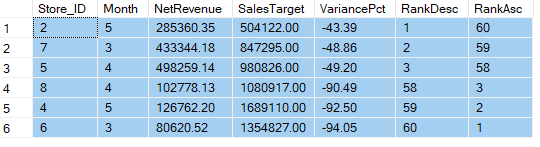
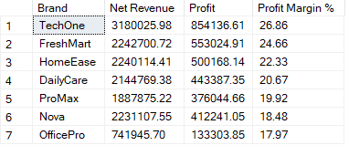
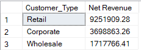
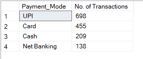

# Sales MIS Dashboard

## 📌 Overview
In this project I tried to build an end-to-end MIS reporting solution:
- Migrated Excel sheets into SQL tables
- Created SQL views to simplify reporting
- Connected SQL data to Power BI
- Built an interactive dashboard with KPIs and visualizations
- Used ChatGPT to generate synthetic Excel data for demonstration purposes

The dashboard provides a comprehensive view of sales performance across products, stores, regions, payment modes, and brands.

## 🔑 Key Findings
- **Regional Sales:** West region contributes ~60% of total sales, making it the dominant market.
- **Brand Profitability:** TechOne is the most profitable brand (26.1%), followed by FreshMart and HomeEase.
- **Category Insights:** Grocery (20.67%) and Electronics (19.6%) drive the majority of category sales.
- **Top Stores:** Hyderabad (1.8M) and Bengaluru (1.7M) are the highest revenue-generating stores.
- **Top Products:** Work Desk (2.2M) leads product revenue, followed by Air Fryer and Study Desk.
- **Payment Trends:** UPI is the most used payment mode (698 transactions), showing digital adoption.
- **Revenue Trend:** Consistent growth observed, with June reaching the highest revenue (2.73M).

## 🛠 Tools Used
- SQL (data migration, table creation, and views for simplified reporting)
- Excel (synthetic dataset created using ChatGPT)
- Power BI (dashboard design and visualization)

## 📊 Dashboard Preview
[!(Sales MIS dashboard.png)](https://github.com/vidula-27/Sales-MIS-Dashboard/blob/main/Sales%20MIS%20dashboard.png)

## 🚀 How to Use
1. Clone the repository
2. Open the `.pbix` file in Power BI
3. Connect to the SQL database using provided scripts
4. Explore the dashboard with filters (Month, Region, Brand, etc.)

## 📑 SQL Business Queries
This project also includes SQL scripts to answer key business questions:

## 📑 SQL Business Queries with Outputs

- [Top 10 Products](SQL_Queries/Top10Products.sql)  
  
  💡 Work Desk is the highest revenue generator at ₹2.24M.

- [Bottom 10 Products](SQL_Queries/Bottom10Products.sql)  
    
  
  💡 Hyderabad Store leads with ₹1.76M, while Pune Store lags at ₹1.22M.

- [High Sales, Low Stock](SQL_Queries/HighSalesLowStock.sql)  
  
  💡 Fast‑moving products like Study Desk and Table Fan show critically low closing stock.

- [Category Revenue & Profit](SQL_Queries/CategoryRevenueProfit.sql)  
  
  💡 Furniture dominates revenue at ₹6.29M with strong profit margins (~23%).

- [Store Target Variance](SQL_Queries/StoreTargetVariance.sql)  
  
  💡 Several stores underperform, with variance dropping below ‑90% against targets.

- [Brand Profitability](SQL_Queries/BrandProfitability.sql)  
  
  💡 TechOne brand delivers the highest margin at 26.8%.

- [Customer Revenue](SQL_Queries/CustomerRevenue.sql)  
  
  💡 Retail customers generate the majority of revenue (~₹9.25M).

- [Payment Mode](SQL_Queries/PaymentMode.sql)  
  
  💡 UPI is the most popular payment mode with 698 transactions.

## 🎯 Career Context
With 4.8 years of experience as a Data Analyst (SQL, Excel, Power BI), I am currently on a career break and preparing to re-enter the workforce as a MIS Analyst / Data Analyst / MIS Executive. 
Through this project I aimed to stay updated, strengthen my portfolio, and showcase my ability to deliver business-ready dashboards and actionable insights.
